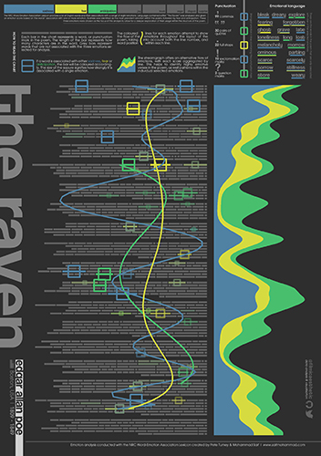
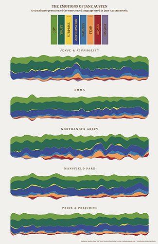
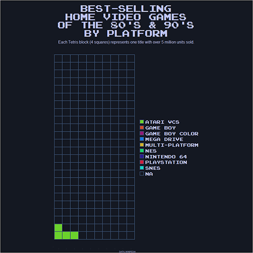

## Hello! 👋 I’m Dan

- 📊 Data analyst in charity retail & e-commerce
- 🤓 Data science and creative data visualisation with R
- 👩🏼‍🎓 Self-taught data professional, learning fast on the job
- 📱 Curious about front-end web development as a tool to tell better data stories
- 📷 Big photography nerd, hence the username!

## Skills

---

✅ Work | ↗️ Play | ⏯ Soon

---

### ✅ R ✅ SQL ✅ Power BI ✅ Shiny ✅ Git ↗️ Python ↗️ HTML ↗️ CSS 
↗️ Microsoft Azure
 ⏯ Javascript

## Recent Projects

#### Art, Music, Literature

#### Jane Austen Emotion Analysis

#### Tetris Plot

